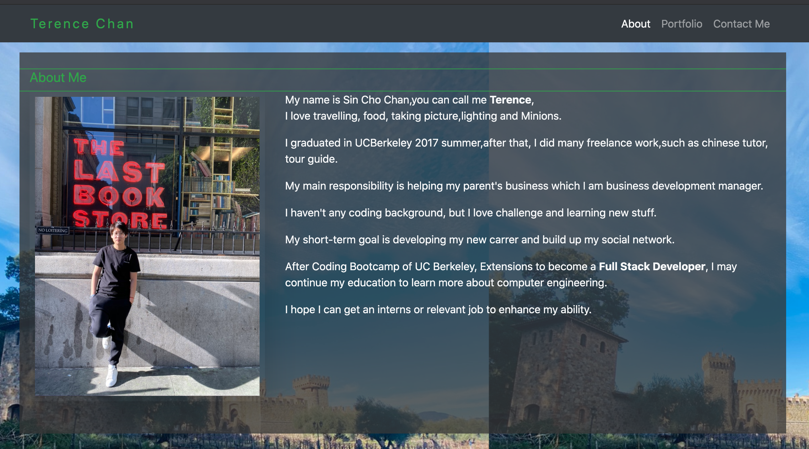
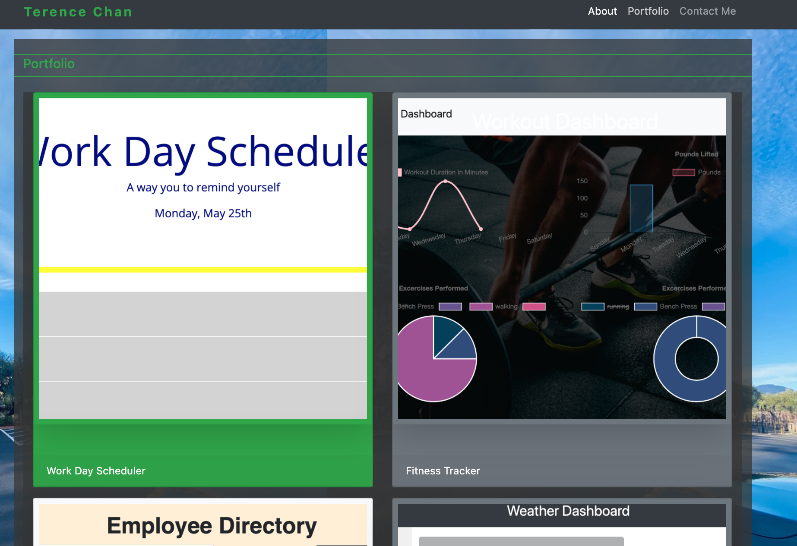
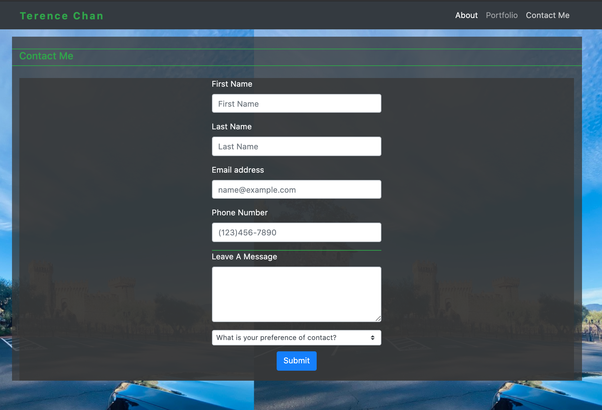

# Project Title

SIN CHO CHAN : React Portfolio 

## Location of URLs

This is the link to the github repo:
 
https://github.com/SINCHOCHAN/ReactPortfolio 

This is the link to the live website:

https://sinchochan.github.io/ReactPortfolio/ 

This is the link to deploy to Heruko
https://frozen-taiga-04252.herokuapp.com/

### Description

- There are 3 links to 3 different websites which is A contact me, portfolio and an About me page.

- The homepage shows my personal information

- the Portfolio Page shows that 6 projects

- Contact page allows people to reach me

### libraries

- HTML, CSS, the Bootstrap framework, JavaScript, react, Semantic UI

### Screenshot

